<div align="center">

# 🍃 Daily Intake

### Your private, AI-powered food & fitness tracker — in plain English.

**Type what you ate. Get the macros. That's it.**

No barcode scanning. No 40-field food forms. No subscription. You write *"2 eggs, 43g oats, a tablespoon of honey and 205g milk"* and the AI resolves every macro, vitamin, and mineral — then shows you two numbers and two lists.

Built as an installable PWA (Progressive Web App) — add it to your home screen and it behaves like a native app. No App Store, no install friction.

<br/>

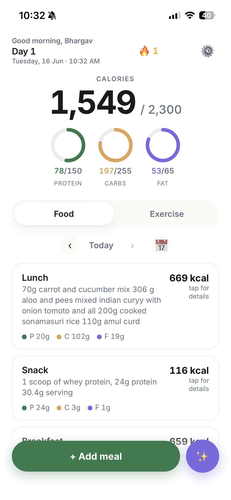
&nbsp;
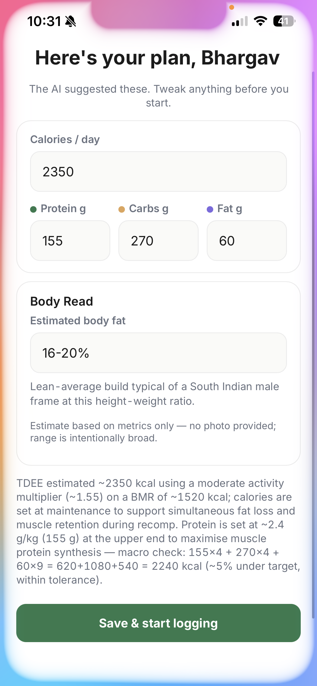
&nbsp;
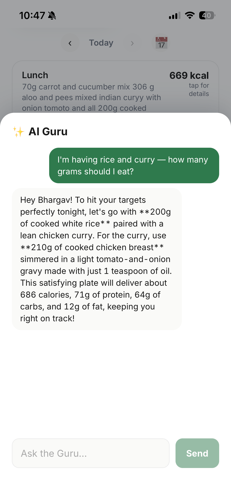

<br/>


-4285F4?logo=google&logoColor=white)


</div>

---

## ✨ What it does

| | Feature | How it works |
|---|---|---|
| 🍽️ | **Plain-English food logging** | Type or snap a photo of your meal. Gemini (with Google Search grounding) identifies every item, looks up real macros, and estimates vitamins & minerals. |
| 🏋️ | **Plain-English workout logging** | *"3 sets bench 60kg x 8, 3 sets incline db 22kg x 10"* → structured sets, reps, volume, and estimated calories. |
| 🎯 | **AI-built macro targets** | At onboarding, Claude Sonnet 4.6 reads your stats (and optional photos + medical docs) and generates safe, personalized calorie & macro goals — with a body-fat *range* and the reasoning behind every number. |
| 🤖 | **AI Guru chat** | A diet coach that knows *today's* intake and remaining macros. Ask *"how much rice should I eat tonight?"* and it answers in grams that actually fit your day. |
| 📊 | **Weekly insights** | After 7 days of logs, get a grounded read on where you are vs. your goal and the single most useful adjustment — no shaming, no filler. |
| 🔁 | **Weekly check-in** | Re-enter weight, and Claude proposes a macro adjustment. Nothing changes unless you accept it. |
| 🩺 | **Medical context (optional)** | Upload lab reports / doctor notes (PDF, DOCX, TXT). Used *only* as safety context for conservative planning — never as diagnosis. |
| 📁 | **Export everything** | One tap → a full `.xlsx` of every meal, workout, and macro. Your data is yours. |
| 🔒 | **Truly private & multi-user** | Anyone can sign in with Google; every row is locked to its owner by Postgres row-level security. Photos and documents live in private storage buckets. |

---

## 📸 A walk through the app

<div align="center">

### Onboarding — a 6-step conversation, not a form

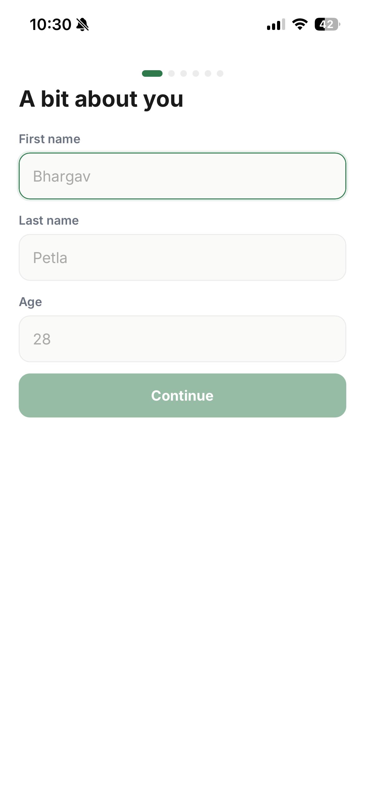
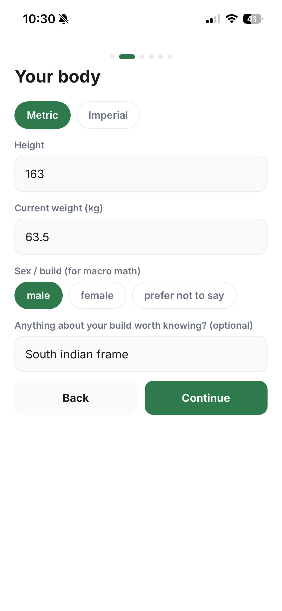
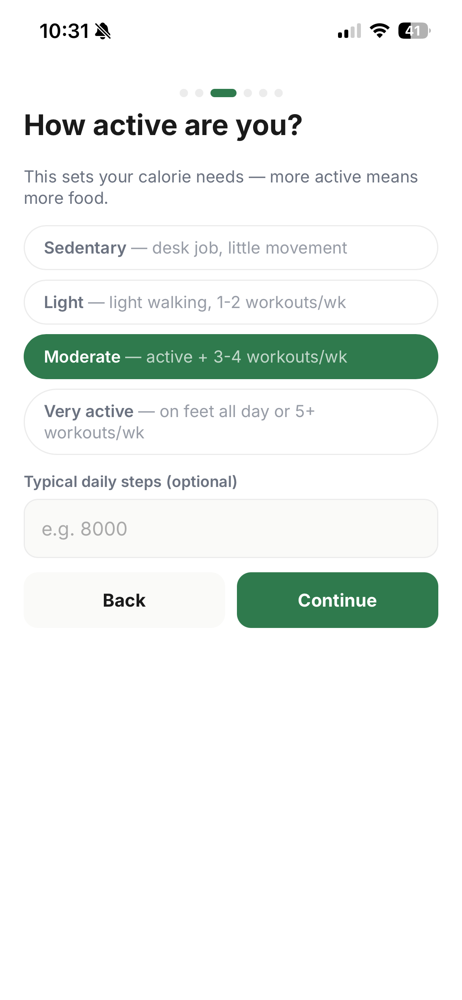
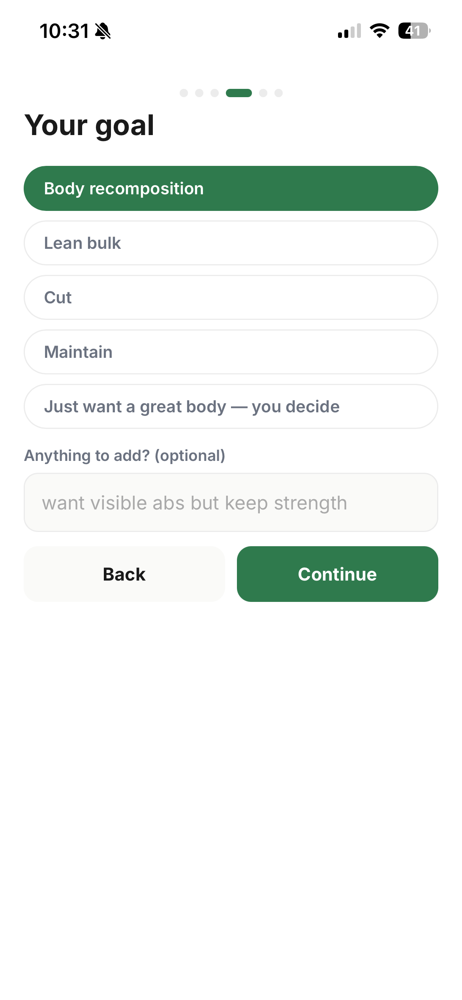

*Name & age → body metrics → activity level → goal (recomp / bulk / cut / maintain)…*

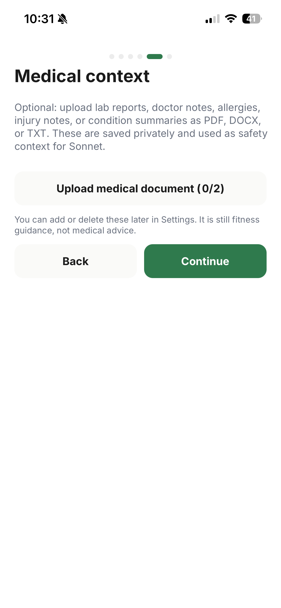
&nbsp;
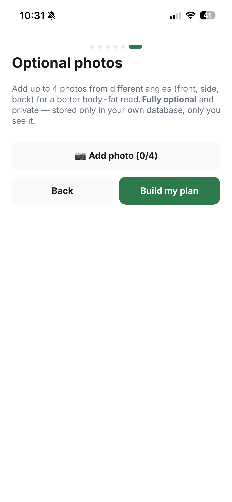
&nbsp;


*…optional medical docs → optional body photos → **Claude builds your plan**, with the full reasoning shown.*

<br/>

### Daily use — log, see, adjust


&nbsp;
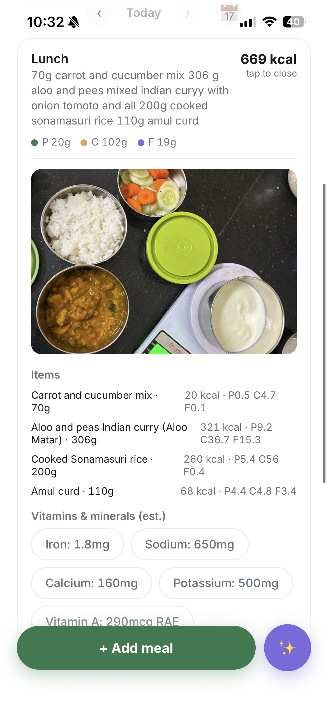
&nbsp;
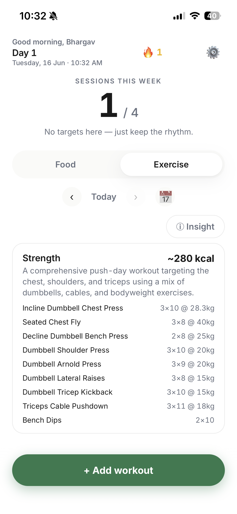

*The whole day on one screen: calories ring + protein / carbs / fat. Tap a meal for the full per-item macro and vitamin breakdown. Switch to the Exercise tab for parsed workouts.*

<br/>

### Coaching — Guru chat & weekly insight

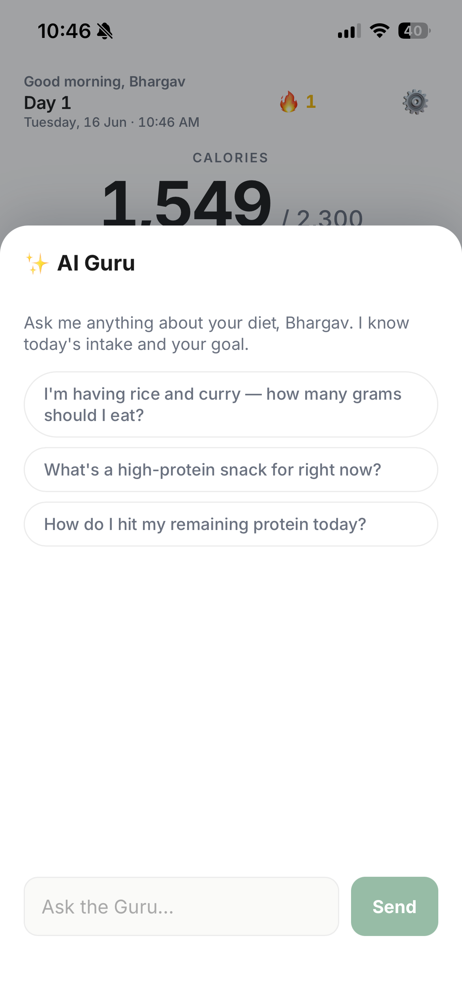
&nbsp;

&nbsp;
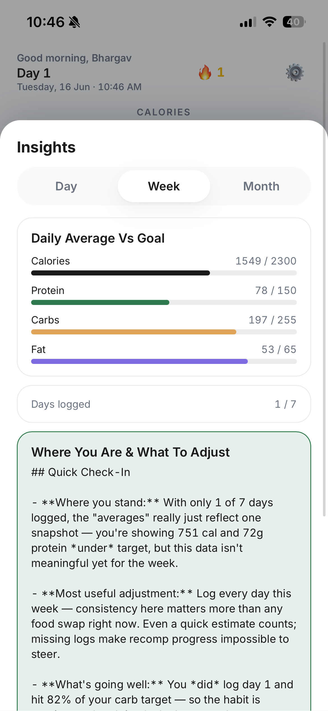

*Ask the Guru anything — it answers using your remaining macros. After a week, insights show your average vs. goal and what to tweak.*

<br/>

### Settings — full control of your data

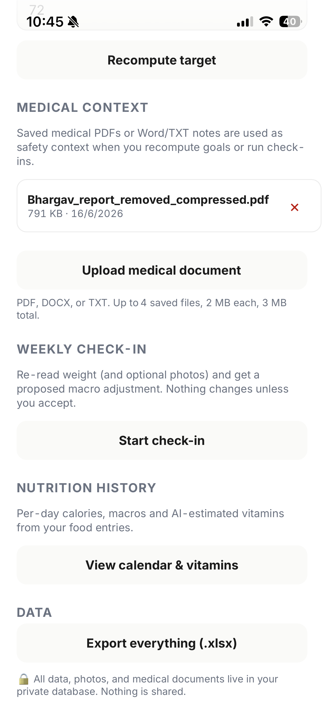

*Recompute targets, manage medical docs, run a check-in, browse nutrition history, export to Excel, or delete your account entirely.*

</div>

---

## 🧰 Tech stack

- **[Next.js 15](https://nextjs.org/)** (App Router) — deployed on **Vercel**
- **[Supabase](https://supabase.com/)** — Google OAuth, Postgres with row-level security, private file storage
- **[Claude Sonnet 4.6](https://docs.claude.com/)** (`claude-sonnet-4-6`) — body analysis, macro targets, weekly check-in & progress summaries
- **[Gemini Flash](https://ai.google.dev/)** (Google Search grounding) — food macro lookup, workout parsing, weekly insight, the Guru chat
- **Gemini image model** — one-time illustrations & app icon
- **[SheetJS](https://sheetjs.com/)** — client-side Excel export
- **PWA** — web manifest + offline-shell service worker

> 🔐 **All AI keys and the Supabase service-role key are used server-side only** (inside `/api/*` route handlers). The browser bundle never references them.

---

## 🚀 Setup guide

You'll need **three free accounts**: Supabase, Google AI Studio (Gemini), and Anthropic (Claude). Total setup time is about **15 minutes**. Follow the steps in order.

### Prerequisites

- **Node.js 20+** and npm — [download here](https://nodejs.org/)
- A **Google account** (for sign-in + Gemini)

---

### Step 1 — Clone & install

```bash
git clone https://github.com/bhargavpetla/fitness.git
cd fitness
npm install
```

Then create your local env file from the template:

```bash
cp .env.example .env
```

You'll fill in `.env` as you collect each key below.

---

### Step 2 — 🟢 Supabase (database, auth & storage)

Supabase is the backend: it stores your data, handles Google sign-in, and keeps photos private.

1. Go to **[supabase.com/dashboard](https://supabase.com/dashboard)** → **New project** (free tier is plenty). Pick a name, a strong database password, and a region close to you.
2. Wait ~2 minutes for it to provision.
3. Open **Project Settings → API** and copy these three values into your `.env`:

   | Supabase value | `.env` variable |
   |---|---|
   | Project URL | `NEXT_PUBLIC_SUPABASE_URL` |
   | `anon` `public` key | `NEXT_PUBLIC_SUPABASE_ANON_KEY` |
   | `service_role` `secret` key | `SUPABASE_SERVICE_ROLE_KEY` |

   ```env
   NEXT_PUBLIC_SUPABASE_URL=https://xxxxxxxx.supabase.co
   NEXT_PUBLIC_SUPABASE_ANON_KEY=eyJhbGci...
   SUPABASE_SERVICE_ROLE_KEY=eyJhbGci...
   ```

   > ⚠️ The `service_role` key bypasses all security rules. Keep it secret — it's only ever used server-side and is never sent to the browser.

#### Create the database tables

4. In the Supabase dashboard, open **SQL Editor** → **New query**.
5. Paste the **entire contents** of [`supabase/schema.sql`](supabase/schema.sql) → click **Run**.

   This creates every table, all row-level-security policies (each row locked to its owner), and the private `photos` and `medical-documents` storage buckets.

   > 💡 The script is **idempotent** — it uses `if not exists` and safe policy replacement. After you pull future schema changes, just run it again; it adds new tables/buckets without wiping data.

---

### Step 3 — 🔵 Enable Google sign-in

Authentication is Google OAuth via Supabase — there are **no auth keys in `.env`**; you configure the provider in two dashboards.

#### 3a. Create Google OAuth credentials

1. Go to the **[Google Cloud Console](https://console.cloud.google.com/)** → create (or pick) a project.
2. **APIs & Services → OAuth consent screen** → choose **External** → fill in the app name and your email. Add yourself as a **Test user** while in testing.
3. **APIs & Services → Credentials → Create Credentials → OAuth client ID** → application type **Web application**.
4. Under **Authorized redirect URIs**, add your Supabase callback URL (find it in the next step):
   ```
   https://<your-project-ref>.supabase.co/auth/v1/callback
   ```
5. Copy the generated **Client ID** and **Client Secret**.

#### 3b. Connect it to Supabase

6. In Supabase → **Authentication → Providers → Google** → toggle **Enable**.
7. Paste the **Client ID** and **Client Secret** from step 3a → **Save**. (This page also shows the exact callback URL to paste back in step 3a-4 if you skipped it.)

#### 3c. Set the redirect URLs

8. In Supabase → **Authentication → URL Configuration**:
   - **Site URL**: `http://localhost:3000` (you'll change this to your production URL after deploying)
   - **Redirect URLs** — add both:
     ```
     http://localhost:3000/auth/callback
     ```

> 👥 **Multi-user by design:** anyone can sign in with Google and gets their own private space. There's no allow-list — data isolation is enforced by Postgres row-level security, not by hiding the login page.

---

### Step 4 — 🟣 AI keys (Gemini + Claude)

| Key | Where to get it | `.env` variable |
|---|---|---|
| **Gemini** (food & workout parsing, Guru) | [Google AI Studio → Get API key](https://aistudio.google.com/apikey) | `GEMINI_API_KEY` |
| **Claude** (macro plan, check-ins) | [Anthropic Console → API Keys](https://console.anthropic.com/settings/keys) | `ANTHROPIC_API_KEY` |

```env
GEMINI_API_KEY=AIza...
ANTHROPIC_API_KEY=sk-ant-api03-...
```

The model strings are already set in `.env.example` and rarely need changing:

```env
ANTHROPIC_MODEL=claude-sonnet-4-6
GEMINI_FOOD_MODEL=gemini-3.5-flash
GEMINI_EXERCISE_MODEL=gemini-3.5-flash
GEMINI_IMAGE_MODEL=gemini-3.1-flash-image
```

> 💸 Both providers have free tiers / trial credits that comfortably cover personal use. Costs are per-request and tiny for a single user.

---

### Step 5 — ▶️ Run it

```bash
npm run dev
```

Open **[http://localhost:3000](http://localhost:3000)**, click **Continue with Google**, sign in, and complete the onboarding flow. You're live. 🎉

---

## ☁️ Deploy to Vercel

1. Push your fork to GitHub, then **[import the repo into Vercel](https://vercel.com/new)**.
2. In **Vercel → Settings → Environment Variables**, add **every** variable from your `.env` (all the Supabase, Gemini, and Claude values).
3. Add your production URL too:
   ```env
   NEXT_PUBLIC_SITE_URL=https://your-app.vercel.app
   ```
4. Back in **Supabase → Authentication → URL Configuration**, update for production:
   - **Site URL** → `https://your-app.vercel.app`
   - **Redirect URLs** → add `https://your-app.vercel.app/auth/callback` (keep the localhost one for local dev)
5. In the **Google Cloud Console**, make sure the OAuth consent screen is **published** (not just "Testing") if you want anyone — not only test users — to sign in.
6. Redeploy.

> 🧭 The app uses the browser's actual origin for the OAuth redirect, so it works correctly across localhost and production without per-environment guesswork — as long as both callback URLs are allow-listed in Supabase.

---

## 📱 Install on your phone

Open the deployed URL in **Safari (iOS)** or **Chrome (Android)** → **Share → Add to Home Screen**. It launches full-screen, hides the browser chrome, and stays signed in until you log out.

---

## 🔐 Security & privacy notes

- **Rotate any leaked keys.** If you ever committed real keys during development, rotate them in Supabase / Google / Anthropic before going public.
- `.env` is **gitignored** — never commit it. Use `.env.example` as the shared template.
- Every database row is protected by **row-level security**: a signed-in user can only ever read or write their own data.
- **Photos and medical documents** live in **private** Supabase storage buckets, accessed through signed URLs — they are never publicly listable.
- **Account deletion** (in Settings) removes private storage files first, then deletes the Supabase auth user so all database rows cascade away.
- Medical document handling is **safety context only** — the app never diagnoses, interprets labs as medical advice, or overrides a clinician.

---

## 🗂️ Project structure

```
src/
├── app/
│   ├── login/            Google sign-in screen
│   ├── auth/callback/    OAuth code → session exchange
│   ├── onboarding/       6-step intake flow
│   ├── settings/         profile, check-in, export, account deletion
│   └── api/              server-only route handlers (all AI + DB writes)
│       ├── food/parse        Gemini grounded macro lookup
│       ├── exercise/*        workout parsing + weekly insight
│       ├── onboarding/*      Claude body analysis + goal save
│       ├── checkin/*         weekly re-assessment
│       ├── guru/             diet Q&A chat
│       └── account/delete    full data wipe
├── components/           MainApp, AddSheet, GuruChat, CheckIn, CalendarView…
├── lib/
│   ├── ai/anthropic.ts   Claude calls + JSON extraction
│   ├── ai/gemini.ts      Gemini calls (food, exercise, Guru, images)
│   ├── supabase/         SSR + browser clients
│   ├── db.ts             typed data access
│   └── env.ts            centralized env access (public vs. server-only)
└── middleware.ts         session refresh + route guarding
supabase/schema.sql       tables, RLS policies, storage buckets
```

---

## 📄 License

Released under the **[MIT License](LICENSE)** — free to use, modify, and distribute, including commercially. Just keep the copyright notice.

---

<div align="center">

Built with 🍃 — plain English in, healthy habits out.

</div>

## Asset credits

- Exercise animations & thumbnails © [Gym visual](https://gymvisual.com/) via [exercises-dataset](https://github.com/hasaneyldrm/exercises-dataset) (redistributed with permission, 180×180, attribution required).
- Chrome icons: [Ionicons](https://github.com/ionic-team/ionicons) (MIT).
- Guru icon: [Microsoft Fluent Emoji](https://github.com/microsoft/fluentui-emoji) (MIT).
- Indian dish macros: [Indian Nutrient Databank](https://github.com/lindsayjaacks/Indian-Nutrient-Databank-INDB-); recipes/photos: Archana's Kitchen dataset.
- Liquid glass effect ported from [deepika-builds/liquid-glass](https://github.com/deepika-builds/liquid-glass) (MIT).
